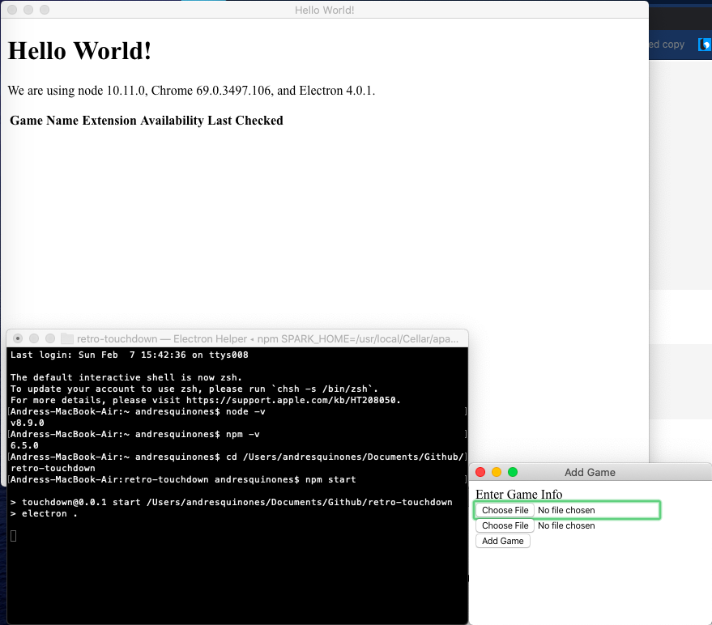

# retro-touchdown
## Description
Retro game and save manager made using Electron. 
Application is intended to safely store Retro Games and Saves on a local server and allow for emulation devices to pull aforementioned games and saves.

### What works
Currently the server application has the functionality to parse the file system tree for eligible file types. They can be added to the application and displayed using a table in HTML.

### Screenshots
This is what it looks like when the add games feature is used. User is prompted for a directory. .


This is what it looks like when imported into the application. .

### How to run
Make sure Node is installed 
```
node -v
npm -v
```

Create a directory you will be running the application from
```
mkdir my-electron-app && cd my-electron-app
npm init -y
npm i --save-dev electron
```
Copy the repository files into this folder

Open the folder in terminal and run the application with the following command
```
npm start
```
